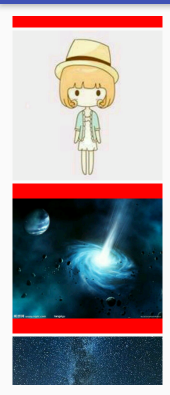

## Glide入门教程一（基本使用）

### 添加依赖
```
compile 'com.github.bumptech.glide:glide:3.7.0'
```

### 简单介绍

* with(Context context)- Context是许多Android API需要调用的， Glide也不例外。这里Glide非常方便，你可以任意传递一个Activity或者Fragment对象，它都可以自动提取出上下文。
* load(String imageUrl) - 这里传入的是你要加载的图片的URL，大多数情况下这个String类型的变量会链接到一个网络图片。
* into(ImageView targetImageView) - 将你所希望解析的图片传递给所要显示的ImageView


### 加载url网络图片
* 权限
```
<uses-permission android:name="android.permission.INTERNET"/>
```
* 加载图片

```
 Glide.with(this).load("http://img1.imgtn.bdimg.com/it/u=2615772929,948758168&fm=21&gp=0.jpg").into(mIv1);
```
这几行！如果这个URL链接的图片的确存在，并且你的ImageView可见，你将会在1~2秒见到这张图片被加载。假如这张图片不存在，Glide会回调相应的出错接口下面说


### 加载本地图片

* File 文件
```
 //本地图片路径 /storage/emulated/0/1470634823290.jpg
        String path ="/storage/emulated/0/1470634823290.jpg";

        File file = new File(path);

        Glide.with(this).load(file).into(mIv3);
```
* 转换的URI
```
 //本地图片路径 /storage/emulated/0/1470634823290.jpg
        String path ="/storage/emulated/0/1470634823290.jpg";

        File file = new File(path);

       // Glide.with(this).load(file).into(mIv3);
        Uri uri = Uri.fromFile(file);


       Glide.with(this).load(uri).into(mIv3);
```
如果图片不显示建议设置要控件的宽与高，后面再说怎么解决


### 加载资源图片
这里是一个Int型的的资源id。
```
Glide.with(this).load(R.mipmap.test).into(mIv2);
```


-------


## Glide入门教程二ListView中使用


### 添加RecyclerView

* 准备数据

```

    /**
     * 准备数据
     */
    String [] mDatas = new String[]{

            "http://b337.photo.store.qq.com/psb?/V10FcMmY1Ttz2o/7.fo01qLQ*SI59*E2Wq.j82HuPfes*efgiyEi7mrJdk!/b/dLHI5cioAQAA&bo=VQOAAgAAAAABB*Q!&rf=viewer_4",
            "http://b118.photo.store.qq.com/psb?/V10FcMmY2gHuOI/8*6eK6PHCNTx1utXooId*KAWgwPTllj.b6uBg4McCwM!/b/dAt8W0YJJAAA&bo=VQOAAgAAAAABB*Q!&rf=viewer_4",
            "http://img1.imgtn.bdimg.com/it/u=488611129,2377736106&fm=11&gp=0.jpg",
            "http://img2.imgtn.bdimg.com/it/u=3398443685,2594061265&fm=11&gp=0.jpg",
            "http://img3.imgtn.bdimg.com/it/u=2271902832,1324672617&fm=21&gp=0.jpg",
            "http://a.hiphotos.baidu.com/image/h%3D200/sign=d20242020e24ab18ff16e63705fae69a/267f9e2f070828389f547b30bf99a9014c08f1bd.jpg",
            "http://img5.duitang.com/uploads/item/201406/28/20140628132554_UNE4n.thumb.700_0.jpeg",
            "http://cdn.duitang.com/uploads/item/201309/22/20130922202150_ntvAB.thumb.600_0.jpeg",
            "http://cdn.duitang.com/uploads/item/201208/04/20120804013554_yRGfe.jpeg",
            "http://img5.imgtn.bdimg.com/it/u=2050390856,2980742959&fm=21&gp=0.jpg",
            "http://img3.duitang.com/uploads/item/201501/23/20150123204322_N8nw5.jpeg",
            "http://img4q.duitang.com/uploads/item/201505/09/20150509204813_nEwxF.jpeg",
            "http://img1.imgtn.bdimg.com/it/u=2432702027,3704029716&fm=21&gp=0.jpg",
            "http://i.imgur.com/syELajx.jpg",
            "http://i.imgur.com/COzBnru.jpg",
            "http://i.imgur.com/Z3QjilA.jpg"


    };
```
* Activity

```
 private void initData() {


        mGlideListUseAdapter = new GlideListUseAdapter(this,mDatas);

        LinearLayoutManager linearLayoutManager = new LinearLayoutManager(this,LinearLayoutManager.VERTICAL,false);

        mRecyclerView.setLayoutManager(linearLayoutManager);


        mRecyclerView.setAdapter(mGlideListUseAdapter);


    }
```

* adapter

> 布局
```


    <ImageView
               android:layout_margin="2dp"
               android:id="@+id/iv"
               android:layout_width="200dp"
               android:layout_height="200dp">

    </ImageView>
```

> adapter
```android
public class GlideListUseAdapter extends RecyclerView.Adapter<GlideListUseAdapter.ViewHolder> {


    Context      mContext;
    String [] mDatas;

    LayoutInflater mInflater;

    public GlideListUseAdapter(Context context, String [] datas) {
        this.mContext = context;
        this.mDatas = datas;
        mInflater= LayoutInflater.from(context);
    }

    @Override
    public ViewHolder onCreateViewHolder(ViewGroup parent, int viewType) {

        View itemView = mInflater.inflate(R.layout.item_glide_list_use,parent,false);

        return new ViewHolder(itemView);
    }

    @Override
    public void onBindViewHolder(ViewHolder holder, int position) {

        String url = mDatas[position];


        Glide.with(mContext).load(url).into(holder.mIv);

    }

    @Override
    public int getItemCount() {
        if(mDatas!=null){

           return mDatas.length;
        }
        return 0;
    }

    public class  ViewHolder extends RecyclerView.ViewHolder {
        ImageView mIv;
        public ViewHolder(View itemView) {

            super(itemView);

            mIv = (ImageView) itemView.findViewById(R.id.iv);
        }
    }
}

```

这样图片就显示出来了

## Glide入门教程三 占位图-淡入淡出效果-添加动画

* 占位图
网络的环境不好，加载过程可能需要花费大量的时间。这时候就需要一个占位图先显示出来，直到实际的图片加载并处理完毕。

```
Glide.with(mContext) //上下文
                .load(url) //图片地址
                .placeholder(R.mipmap.pictures_no) //占位图
                .into(holder.mIv); //显示在哪个控件中
```

* 出错的占位图 .error()
假设我们的app尝试从网页加载一张图片，但网页不可访问,Glide会给我们选项去进行出错的回调，并采取合适的行动

```
  Glide.with(mContext) //上下文
                .load(url) //图片地址
                .placeholder(R.mipmap.pictures_no) //占位图
                .error(R.mipmap.ic_launcher)  //出错的占位图
                 .into(holder.mIv); //显示在哪个控件中
```

加载前显示placeholder中的图片资源，加载失败就显示error中的图片资源
error()可以接受的只能是已经被初始化的图片资源或者指向图片资源的id

### 渐变动画 .crossFade()

crossFade()
```

        Glide.with(mContext) //上下文
                .load(url) //图片地址
                .placeholder(R.mipmap.pictures_no) //占位图
                .error(R.mipmap.ic_launcher)  //出错的占位图
                .crossFade(5000)                 //淡入淡出 可以不写默认300
                 .into(holder.mIv); //显示在哪个控件中
```

淡入淡出 -不写默认也会有值是300毫秒
crossFade()方法有另外一个特征：.crossFade(int duration),如果你想要减慢（或加快）动画，随便传入一个毫秒级的时间进去感受一下。


#### dontAnimate()的使用
如果你只是直接显示图片，而不需要crossfade效果，那就在Glide的请求构造里调用.dontAnimate()


### animate 添加自定义的动画

```
<?xml version="1.0" encoding="utf-8"?>
<set xmlns:android="http://schemas.android.com/apk/res/android">

    <alpha android:fromAlpha="0"
           android:duration="3000"
            android:toAlpha="1"/>

    <scale android:fromXScale="0"
           android:fromYScale="0"
           android:pivotX="50%"
           android:pivotY="50%"
           android:toXScale="100%"
           android:toYScale="100%"
           android:duration="3000"/>

    <rotate android:pivotY="50%"
            android:pivotX="50%"
            android:fromDegrees="30"
            android:toDegrees="360"
            android:duration="3000"
        />

</set>
```

* 添加
```

        Glide.with(mContext) //上下文
                .load(url) //图片地址
                .placeholder(R.mipmap.pictures_no) //占位图
                .error(R.mipmap.ic_launcher)  //出错的占位图

                .animate(R.anim.my_alpha)
                 .into(holder.mIv); //显示在哪个控件中

```


这些参数都是独立的，并且设置不依赖彼此。例如，你可以只设置.error()，而不用调用.placeholder()。你可以设置crossFade()动画，而不用设置占位图。参数的任意结合都是可行的


## Glide入门教程四-调整图片大小

### 调整图片大小 override()

Picasso也有同样的能力,resize(x, y)但需要调用fit()方法

用Glide时，如果图片不需要自动适配ImageView，调用override(horizontalSize, verticalSize)，它会在将图片显示在ImageView之前调整图片的大小。

```
   int width = (int) TypedValue.applyDimension(TypedValue.COMPLEX_UNIT_DIP, 200, mContext.getResources().getDisplayMetrics());
        int height   = (int) TypedValue.applyDimension(TypedValue.COMPLEX_UNIT_DIP, 200f, mContext.getResources().getDisplayMetrics());
        Glide.with(mContext) //上下文
                .load(url) //图片地址
                .placeholder(R.mipmap.pictures_no) //占位图
                .error(R.mipmap.ic_launcher)  //出错的占位图
                .override(width,height) //图片显示的分辨率 ，像素值 可以转化为DP再设置
                .animate(R.anim.my_alpha)

                 .into(holder.mIv); //显示在哪个控件中

```

### 缩放图片-centerCrop

Glide提供了变换去处理图片显示，通过设置centerCrop 和 fitCenter，可以得到两个不同的效果。


CenterCrop()会缩放图片让图片充满整个ImageView的边框，然后裁掉超出的部分。ImageVIew会被完全填充满，但是图片可能不能完全显示出。
```
  String url = mDatas[position];


        int width = (int) TypedValue.applyDimension(TypedValue.COMPLEX_UNIT_DIP, 200, mContext.getResources().getDisplayMetrics());
        int height   = (int) TypedValue.applyDimension(TypedValue.COMPLEX_UNIT_DIP, 200f, mContext.getResources().getDisplayMetrics());
        Glide.with(mContext) //上下文
                .load(url) //图片地址
                .placeholder(R.mipmap.pictures_no) //占位图
                .error(R.mipmap.ic_launcher)  //出错的占位图
                .override(width,height) //图片显示的分辨率 ，像素值 可以转化为DP再设置
                .animate(R.anim.my_alpha)
                .centerCrop()
                 .into(holder.mIv); //显示在哪个控件中

```


### 缩放图片-fitCenter
为ImageView加个背景色
```xml

    <ImageView
        android:background="#ff0000"
               android:layout_margin="2dp"
               android:id="@+id/iv"
               android:layout_width="200dp"
               android:layout_height="200dp"/>
```

fitCenter()会缩放图片让两边都相等或小于ImageView的所需求的边框。图片会被完整显示，可能不能完全填充整个ImageView。

```
Glide.with(mContext) //上下文
                .load(url) //图片地址
                .placeholder(R.mipmap.pictures_no) //占位图
                .error(R.mipmap.ic_launcher)  //出错的占位图
                .override(width,height) //图片显示的分辨率 ，像素值 可以转化为DP再设置
                .animate(R.anim.my_alpha)
                .centerCrop()
                .fitCenter()
                 .into(holder.mIv); //显示在哪个控件中
```





centerCrop-fitCenter会相互覆盖，后面调用的后覆盖前面调用的效果

